<style>
.katex {
  border: 0.2em solid #e46c0a;
  padding: 2em;
}
</style>

# CCA Manager User Guide

<!--
- Clear and engaging introduction or welcome note that sets the tone for the UG.
- What this User Guide aims to achieve
- What this software is about
    - Clear and engaging introduction or welcome note that sets the tone for the UG.
    - Identifies the target user or audience and makes appropriate assumptions, such as the level of relatedness, comprehension, and prior knowledge.
-->

<center>
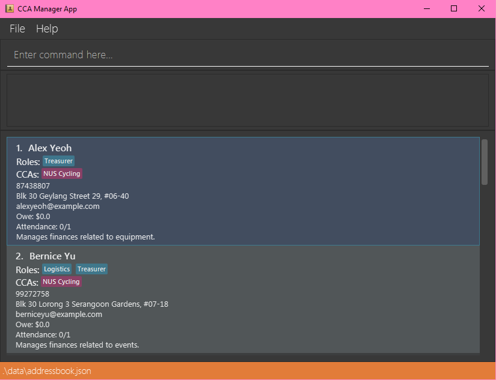
</center>

Welcome to CCA Manager's User Guide! CCA Manager is a **contact manager designed to simplify the management of CCAs and enhance your administrative efficiency**, regardless of whether you're overseeing a sports team, academic club, any other extracurricular activity, or simply a CCA participant. It has a minimal and intuitive [_Graphic User Interface_](#Glossary) where most actions are performed via commands, making it a pleasure to use. If you can type fast, CCA Manager can get your admin tracking done faster than traditional [_Graphic User Interface_](#Glossary) apps.

In this user guide, we'll walk you through the essential steps to harness the full potential of CCA Manager. Whether you're a CCA Executive Committee Member or simply a CCA participant, our guide will provide you with the knowledge and tools you need to make the most of our app.

This user guide does assumes some prior experience with administrative tools and command interfaces. Don't worry if you don't know these, we'll guide you along thew way! If you have further questions while reading this document or while using our app, visit our [FAQ](#faq). If your question isn't answered there, feel free to visit our [project repository](https://github.com/AY2324S2-CS2103T-W11-2/tp/issues) and raise an issue.

This user guide is split into 4 parts:
1. An introduction to what CCA Manager offers,
2. A section to set up our app,
3. Beginner-friendly tutorials that introduce CCA Manager through a practical use case, and
4. A comprehensive reference that explains all of CCA Manager's concepts and features.


<!-- * Table of Contents -->
<page-nav-print><h2>Table of Contents</h2></page-nav-print>

--------------------------------------------------------------------------------------------------------------------

## Product Introduction

<!--
1. Introduction
    - Problem we're trying to solve
    - How the software solves the problem
        - User-centric statement detailing product information, including product description and an overview of main features.
    - Links to basic tutorials (concrete use cases)
-->

Managing contact information and roles for members of CCAs can be a cumbersome task, often involving disparate tools and platforms. Administrators face challenges in efficiently organizing members, coordinating activities, and communicating effectively within these groups.

For instance, the management of contact information and associated information about a CCA activity often involves the use of the following apps: Discord, Telegram, Google Spreadsheets, Sessionize, etc. This makes maintaining administrative information messy, often involving several steps to accomplish a simple task.

CCA Manager endeavors to equip CCAs with tools that streamline administration, freeing up valuable time for more meaningful tasks. We do so by providing a unified solution in the form of the following core features:

1. **Centralized CCA Membership Management**: Easily associate members with their respective CCAs within one app, eliminating the need for multiple platforms.
2. **Efficient Group Actions**: Perform actions on groups of CCA members, such as searching for multiple CCAs at once, and streamlining administrative tasks.
3. **Role Assignment**: Assign roles to CCA members, enhancing organization and clarity within the group.

To get started with CCA Manager and explore its features further, check out our [Installation Guide](#installation-guide) and our [Quick Start](#quick-start), where we'll go through some concrete use cases for our app.

(Reminder: the **blue link** means it has relevant explanations in the Glossary. ^_^ ) 

## Installation Guide

**This Installation guide targets an audience who has knowledge of how to install programs and how to use a command line/terminal.**

<!-- TODO: Make the above disclaimer redundant -->

1. Ensure you have [_Java_](#Glossary) `11` or above installed on your Computer.

1. Download the latest `ccamanager.jar` from [here](https://github.com/se-edu/addressbook-level3/releases). (Click [_here_](#Glossary) if you don't know what is `.jar`)

1. Copy the file to the folder you want to use as the _home folder_ for your CCA Manager.

1. On [**_Linux_**](#Glossary) and [**_macOS_**](#Glossary):
   1. Open a [_command terminal_](#Glossary).
   1. Type `cd <folder>` into the terminal and press `enter`, where you replace `<folder>` with the path to the folder where you've placed `ccamanager.jar`. This navigates the terminal to the correct folder.
   1. Type `java -jar ccamanager.jar` into the terminal and press `enter` to run the application. <br>

1. On [**_Windows_**](#Glossary):
    1. Double-click the `ccamanager.jar` file to run it.

**A [_Graphic User Interface_](#Glossary) similar to below should appear in a few seconds. Note how the app contains some sample data.**<br>

<center>

</center>

To gain an idea of what CCA Manager is about, head down to [Quick Start](#quick-start).

For more details on the commands, visit our [Features](#features) section.

--------------------------------------------------------------------------------------------------------------------
## Quick Start

Confused about where to get started? Don’t fret, in this section, we'll outline how to use CCA Manager to its maximum effect with a few scenarios.

First off, CCA Manager's interface consists of the following main components:

<center>

</center>

1. **Command Box**: A small text box where you type the commands.
3. **Output Box**: Displays any errors that might have occurred, or other information about the most recent command executed.
2. **Results Box**: Displays the results of the command.


All of CCA Manager's functionality is accessed via commands. This includes both adding and editing contacts, as well as accessing existing contacts.

### Upon Booting Up

When you first boot up the app, the app will contain some example contacts for you to get a feel of using CCA Manager's functions.

To run a command, type the command in the **Command Box** and press Enter to execute it. For example, typing **`help`** and pressing Enter will open the help window.

Here are some other example commands you can try:
   * `list`: [Lists all contacts.](#listing-all-persons-list)
   * `delete 3`: [Deletes the 3rd contact shown in the currently displayed list.](#deleting-a-person-delete)
   * `filter c/NUS Cycling`: [Filter contacts by CCA.](#filter-by-cca-and-roles-filter)
   * `exit`: [Exits the app.](#exiting-the-program-exit)
   <!--* `add`: [Adds a contact/CCA group to the CCA Manager](#add-contacts-with-cca-labels)-->
   <!--* `edit`: [Edit details of the contacts.](#edit-the-details-of-your-contacts)-->

Now you can proceed to the [Features](#features) section for a detailed listing of the available commands.

--------------------------------------------------------------------------------------------------------------------

## Features

This section details the available functions of CCA Manager, organised according to the following categories:

1. [General Features](#general-features): General features for a better user experience
2. [Displaying Contacts](#displaying-contacts): Displaying features in the **Results Box**
3. [Editing Contacts](#editing-contacts): Editing contacts in CCA Manager
4. [Deleting Contacts](#deleting-contacts): Deleting contacts in CCA Manager
5. [Storage](#storage)

<!--
# General
Viewing help: help
Exiting the program: exit

# Displaying contacts
Listing all persons: list
Locating persons by name: find
Filter by CCA and roles: filter

# Editing Contacts
Adding a person: add
Editing a person: edit
Set up owe amount money: owe
Delete a CCA: cca_delete
Charge a person with an amount of money: charge
Track attendance: setatt

# Deleting Contacts
Deleting a person: delete
Clearing all entries: clear

# Storage
Saving the data
Editing the data file
Archiving data files [coming in v2.0]
-->

### General Features

#### Viewing help: `help`

Shows a message explaining how to access the help page.

##### Command Format:

$$
\large
\overbrace{\texttt{\colorbox{lightgrey}{help}}}
    ^{\text{\colorbox{lightgrey}{Action}}}
$$

##### Examples:

* `help`

##### Outcome:

The following is the result of executing the following command:

```
help
```

<center>

</center>

A box appears with a button `Copy URL`. Clicking it will allow you to paste the link into your internet browsing application of choice (E.g., Chrome, Safari, Firefox) and view our User Guide.

(Click [_here_](#Glossary) if you don't know what is an URL.)

#### Exiting the program: `exit`

Exits the program.

##### Command Format:

$$
\large
\overbrace{\texttt{\colorbox{lightgrey}{exit}}}
    ^{\text{\colorbox{lightgrey}{Action}}}
$$

##### Examples:

`exit`

##### Outcome:

Nil.

### Displaying Contacts

#### Listing all persons: `list`

Shows a list of all persons in the CCA Manager.

##### Command Format:

$$
\large
\overbrace{\texttt{\colorbox{lightgrey}{list}}}
    ^{\text{\colorbox{lightgrey}{Action}}}
$$

##### Examples:

* `list`

##### Outcome:

The following is the result of executing the following command:

```
list
```

<center>
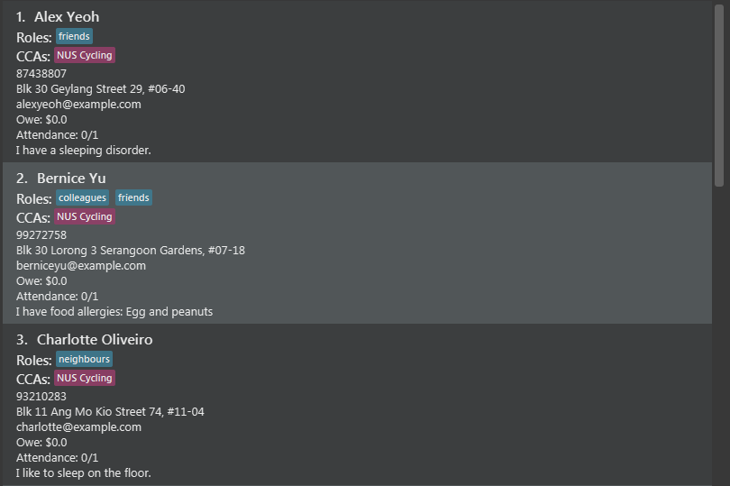
</center>

Everybody added to CCA Manager is listed in the **Results Box**.


#### Locating persons by name: `find`

Finds persons whose names contain any of the given keywords.

##### Command Format:

$$
\large
\begin{aligned}
\overbrace{\texttt{\colorbox{lightgrey}{find}}}
    ^{\text{\colorbox{lightgrey}{Action}}}
\quad &
    \underset{
        \substack{
            \text{\color{red}{Must have at least one}} \\
            \text{\color{red}{word}}
        }
    }{
        \overbrace{
            \texttt{\fcolorbox{tomato}{transparent}{\color{green}{alex}} 
            \quad 
            \fcolorbox{tomato}{transparent}{\color{green}{lee}}}}
            ^{\substack{
                \text{\colorbox{gold}{Word in name}} \\
                \text{\colorbox{gold}{of a person in}} \\
                \text{\colorbox{gold}{CCA Manager}}
            }}
    }
\end{aligned}
$$


<box type="info" seamless>

* The words supplied to `find` are case-insensitive.
    * If you have an `Alex Yeoh` in the app, performing `find alex` will match `Alex Yeoh`.
* The order of the words does not matter.
    * `find alex lee` is the same as `find lee alex`.
* Only full words will be matched.
    * Performing `find al` will not match `Alex Yeoh`
* If a person's name contains at least one of the words supplied to `find`, the person will be matched.
</box>

##### Examples:

* `find Alex`
* `find Alex Yu`

##### Outcome:

The output for `find Alex Yu` is:
<center>
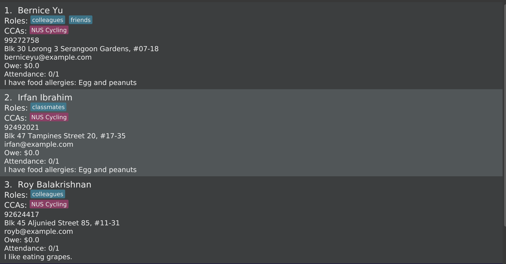
</center>


##### Possible Failures:

If you do not enter a name to find, the command will fail.

#### Filter by CCA and roles: `filter`
Filter the current list with CCA and roles


##### Command Format

$$
\large
\overbrace{\texttt{\colorbox{lightgrey}{filter}}}
    ^{\text{\colorbox{lightgrey}{Action}}}
\quad
\underset{
    \substack{
        \text{\color{red}{Optional}} \\
        \text{\color{red}{can have multiple}}
    }
}{
    \overbrace{\texttt{\colorbox{lavender}{r/}\color{green}{Treasurer}}}
        ^{\text{\colorbox{lavender}{Role(s)}}}
}
\quad
\underset{
    \substack{
        \text{\color{red}{Optional}} \\
        \text{\color{red}{can have multiple}}
    }
}{
    \overbrace{\texttt{\colorbox{plum}{c/}\color{green}{NUS Cycling}}}
        ^{\text{\colorbox{plum}{CCA(s)}}}
}
$$

##### Examples:

* `filter c/NUS Cycling`
* `filter c/NUS Cycling r/classmates`
* `filter c/NUS Cycling r/classmates r/colleagues`

##### Outcome:

For `filter c/NUS Cycling r/classmates r/colleagues`:
<center>
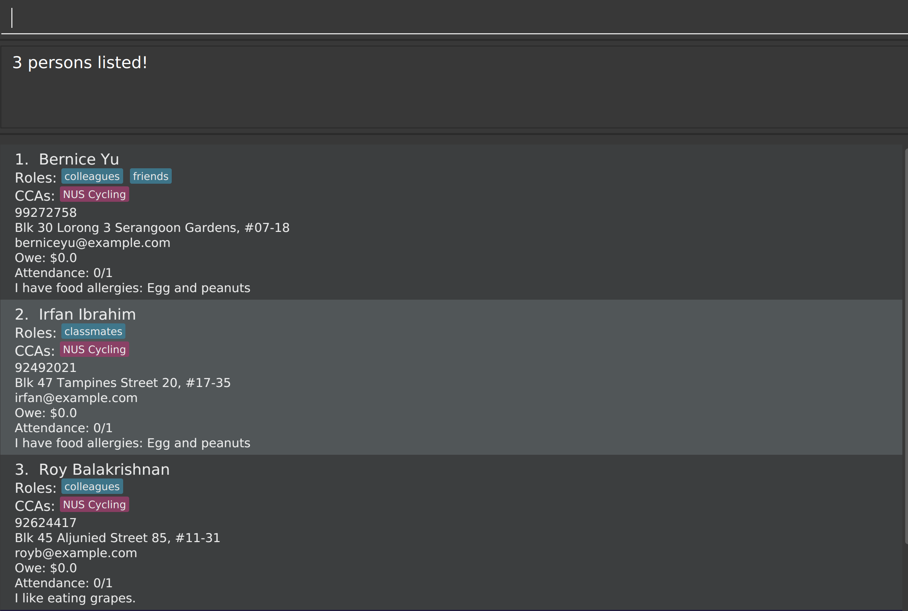
</center>

##### Possible Failures:

Not entering a CCA will cause the command to fail.

### Editing Contacts

#### Adding a person: `add`

Adds a person to the CCA Manager.

##### Command Format:

$$
\large
\begin{aligned}
\overbrace{\texttt{\colorbox{lightgrey}{add}}}
    ^{\text{\colorbox{lightgrey}{Action}}}
\quad &
    \overbrace{\texttt{\colorbox{lightpink}{n/}\color{green}{John Doe}}}
        ^{\text{\colorbox{lightpink}{Name}}}
    \quad
    \overbrace{\texttt{\colorbox{lightblue}{p/}\color{green}{98765432}}}
        ^{\text{\colorbox{lightblue}{Phone number}}}
    \quad
    \overbrace{\texttt{\colorbox{lightgreen}{e/}\color{green}{johnd@example.com}}}
        ^{\text{\colorbox{lightgreen}{Email}}}
    \quad
    \overbrace{\texttt{\colorbox{yellow}{a/}\color{green}{6 Sin Ming \#01-01}}}
        ^{\text{\colorbox{yellow}{Address}}}
\\&
    \underset{
        \substack{
            \text{\color{red}{Optional}} \\
            \text{\color{red}{can have multiple}}
        }
    }{
        \overbrace{\texttt{\colorbox{lavender}{r/}\color{green}{Treasurer}}}
            ^{\text{\colorbox{lavender}{Role(s)}}}
    }
    \quad
    \underset{
        \substack{
            \text{\color{red}{Optional}} \\
            \text{\color{red}{can have multiple}}
        }
    }{
        \overbrace{\texttt{\colorbox{plum}{c/}\color{green}{NUS Cycling}}}
            ^{\text{\colorbox{plum}{CCA(s)}}}
    }
    \quad
    \underset{
        \substack{
            \text{\color{red}{Optional}} \\
            \text{\color{red}{only one allowed}}
        }
    }{
        \overbrace{\texttt{\colorbox{aqua}{d/}\color{green}{Manages money}}}
            ^{\text{\colorbox{aqua}{Description}}}
    }
\end{aligned}
$$


<box type="tip" seamless>

**Tip:**
*  A person can have any number of Role(s) and CCAs(s) (including 0)
*  A person need not have any Description attached.
</box>

##### Examples:

* `add n/John Doe p/98765432 e/johnd@example.com a/6 Sin Ming #01-01`
* `add n/John Doe p/98765432 e/johnd@example.com a/6 Sin Ming #01-01 c/NUS Cycling c/NUS Origami`
* `add n/John Doe p/98765432 e/johnd@example.com a/6 Sin Ming #01-01 r/Treasurer r/Logistics`
* `add n/John Doe p/98765432 e/johnd@example.com a/6 Sin Ming #01-01 d/Manages money`

##### Outcome:

The following is the result of executing the following command:
```
add n/John Doe p/98765432 e/johnd@example.com a/6 Sin Ming #01-01 c/NUS Cycling r/Treasurer r/Logistics d/Manages money
```

<center>
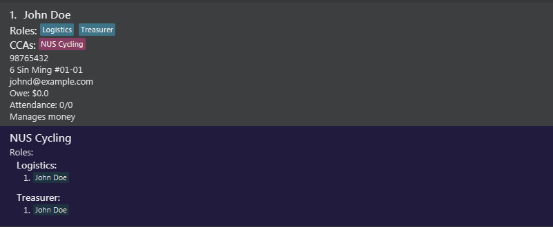
</center>

A person is added to CCA Manager with the information provided in the command, and the new person is displayed in the **Results Box**.

##### Possible Failures:

TODO

#### Editing a person: `edit`

Edits an existing person in the CCA Manager.

##### Command Format:

$$
\large
\begin{aligned}
\overbrace{\texttt{\colorbox{lightgrey}{edit}}}
    ^{\text{\colorbox{lightgrey}{Action}}}
\quad &
    \overbrace{\texttt{\fcolorbox{tomato}{transparent}{\color{green}{1}}}}
        ^{\substack{
            \text{\colorbox{gold}{Index of person}} \\
            \text{\colorbox{gold}{in \textbf{Result Box}}}
        }}
    \quad
    \underset{
        \substack{
            \text{\color{red}{Optional}} \\
            \text{\color{red}{only one allowed}}
        }
    }{
        \overbrace{\texttt{\colorbox{lightpink}{n/}\color{green}{John Doe}}}
        ^{\text{\colorbox{lightpink}{Name}}}
    }
    \quad
    \underset{
        \substack{
            \text{\color{red}{Optional}} \\
            \text{\color{red}{only one allowed}}
        }
    }{
        \overbrace{\texttt{\colorbox{lightblue}{p/}\color{green}{98765432}}}
            ^{\text{\colorbox{lightblue}{Phone number}}}
    }
    \quad
    \underset{
        \substack{
            \text{\color{red}{Optional}} \\
            \text{\color{red}{only one allowed}}
        }
    }{
        \overbrace{\texttt{\colorbox{lightgreen}{e/}\color{green}{johnd@example.com}}}
            ^{\text{\colorbox{lightgreen}{Email}}}
    }
    \quad
    \underset{
        \substack{
            \text{\color{red}{Optional}} \\
            \text{\color{red}{only one allowed}}
        }
    }{
        \overbrace{\texttt{\colorbox{yellow}{a/}\color{green}{6 Sin Ming \#01-01}}}
            ^{\text{\colorbox{yellow}{Address}}}
    }
\\&
    \underset{
        \substack{
            \text{\color{red}{Optional}} \\
            \text{\color{red}{can have multiple}}
        }
    }{
        \overbrace{\texttt{\colorbox{lavender}{r/}\color{green}{Treasurer}}}
            ^{\text{\colorbox{lavender}{Role(s)}}}
    }
    \quad
    \underset{
        \substack{
            \text{\color{red}{Optional}} \\
            \text{\color{red}{can have multiple}}
        }
    }{
        \overbrace{\texttt{\colorbox{plum}{c/}\color{green}{NUS Cycling}}}
            ^{\text{\colorbox{plum}{CCA(s)}}}
    }
    \quad
    \underset{
        \substack{
            \text{\color{red}{Optional}} \\
            \text{\color{red}{only one allowed}}
        }
    }{
        \overbrace{\texttt{\colorbox{aqua}{d/}\color{green}{Manages money}}}
            ^{\text{\colorbox{aqua}{Description}}}
    }
\end{aligned}
$$


<box type="info" seamless>

* `Index of person` **must be a number greater than 0**.
* **At least one** of the optional fields must be provided.
* Existing values will be updated to the input values.
</box>

<box type="tip" seamless>

* To remove all Roles of a person, use `r/nil`.
* To remove all CCAs of a person, use `c/nil`.
</box>

<box type="warning" seamless>

* When editing Roles, (E.g., `edit 1 r/new role`), the existing Roles of the person **will be removed**. I.e., editing of Roles is **not cumulative**.
</box>

##### Examples:

* `edit 1 p/91234567 e/johndoe@example.com`
    * Edits the phone number and email address of the 1st person to be `91234567` and `johndoe@example.com` respectively.
* `edit 2 r/nil`
    * Removes all Roles of the 2nd person.
* `edit 1 c/NUS Rollers c/NUS Origami`
    * Edits the CCAs of the 2nd person to be `NUS Rollers` and `NUS Origami`.

##### Outcome:

Suppose we start with this list of people displayed in the **Results Box**.

<center>
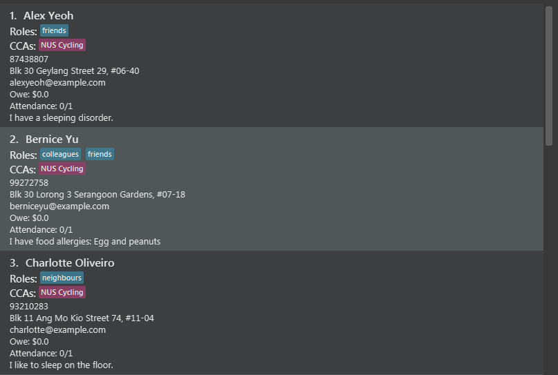
</center>

We then run the following command:

```
edit 2 c/NUS Rollers c/NUS Origami
```

<center>
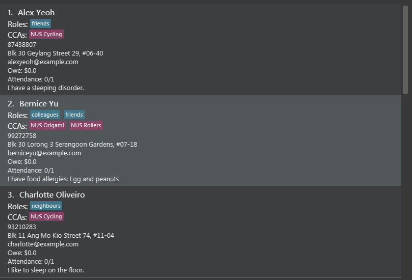
</center>

The 2nd person on the list, Bernice Yu, has her CCAs updated from `NUS Cycling` to both `NUS Origami` and `NUS Rollers`.

##### Possible Failures:

If the entry in the list is not present, the command will fail.

#### Assigning roles to person: `assign`

##### Command Format:

$$
\large
\overbrace{\texttt{\colorbox{lightgrey}{assign}}}
    ^{\text{\colorbox{lightgrey}{Action}}}
\quad
\overbrace{\texttt{\fcolorbox{tomato}{transparent}{\color{green}{1}}}}
    ^{\substack{
        \text{\colorbox{gold}{Index of person}} \\
        \text{\colorbox{gold}{in \textbf{Result Box}}}
    }}
\quad
\underset{
    \substack{
        \text{\color{red}{must have at least one}} \\
        \text{\color{red}{can have multiple}}
    }
}{
    \overbrace{\texttt{\colorbox{lavender}{r/}\color{green}{Treasurer}}}
        ^{\text{\colorbox{lavender}{Role(s)}}}
}
$$

##### Examples:

* (Assuming you have a list of people displayed) `assign 1 r/Treasurer`

##### Outcome:

For `assign 1 r/Treasurer`
<center>
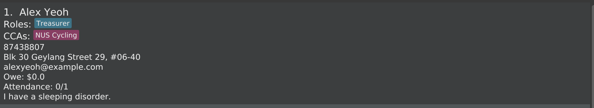
</center>

##### Possible Failures:

If the entry does not exist, the ocmmand will fail.

#### Track a person owing money: `owe`

Set up the amount of money a person owes.

##### Command Format:

$$
\large
\overbrace{\texttt{\colorbox{lightgrey}{owe}}}
    ^{\text{\colorbox{lightgrey}{Action}}}
\quad
\overbrace{\texttt{\fcolorbox{tomato}{transparent}{\color{green}{1}}}}
    ^{\substack{
        \text{\colorbox{gold}{Index of person}} \\
        \text{\colorbox{gold}{in \textbf{Result Box}}}
    }}
\quad
\overbrace{\texttt{\colorbox{aquamarine}{m/}\color{green}{10.00}}}
    ^{\text{\colorbox{aquamarine}{Amount owed}}}
$$

##### Examples:

* (assuming a list of persons is currently shown) `owe 1 m/10.00`

##### Outcome:

For `owe 1 m/10.00`:
<center>
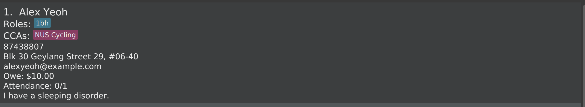
</center>

##### Possible Failures:

If the entry does not exist, the command will fail. The command will also reject
non-numeric amounts of money, or money that exceeds 2 decimal places.

#### Charge a person with money: `charge`
Charge a person with an amount of money by CCA and optionally, by role.

##### Command Format:

$$
\large
\overbrace{\texttt{\colorbox{lightgrey}{charge}}}
    ^{\text{\colorbox{lightgrey}{Action}}}
\quad
\overbrace{\texttt{\colorbox{aquamarine}{m/}\color{green}{10.00}}}
    ^{\text{\colorbox{aquamarine}{Amount to charge}}}
\quad
\underset{
    \substack{
        \text{\color{red}{must have at least one}} \\
        \text{\color{red}{can have multiple}}
    }
}{
    \overbrace{\texttt{\colorbox{plum}{c/}\color{green}{NUS Cycling}}}
        ^{\text{\colorbox{plum}{CCA(s)}}}
}
\quad
\underset{
        \substack{
            \text{\color{red}{Optional}} \\
            \text{\color{red}{can have multiple}}
        }
    }{
        \overbrace{\texttt{\colorbox{lavender}{r/}\color{green}{Treasurer}}}
            ^{\text{\colorbox{lavender}{Role(s)}}}
    }
$$

##### Examples:

* Charges all members in NUS Cycling with the role of "Treasurer":
  `charge m/10.00 c/NUS Cycling r/Treasurer`

##### Outcome:

For `charge m/10.00 c/NUS Cycling r/Treasurer`:
<center>
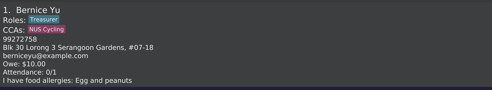
</center>

##### Possible Failures:

If the amount entered is non-numeric, the
command will fail. The command also fails if nobody was charged.
This usually means the CCA or role was invalid.

#### Track attendance: `setatt`


##### Command Format:

$$
\large
\overbrace{\texttt{\colorbox{lightgrey}{setatt}}}
    ^{\text{\colorbox{lightgrey}{Action}}}
\quad
\overbrace{\texttt{\fcolorbox{tomato}{transparent}{\color{green}{1}}}}
    ^{\substack{
        \text{\colorbox{gold}{Index of person}} \\
        \text{\colorbox{gold}{in \textbf{Result Box}}}
    }}
\quad
\overbrace{\texttt{\colorbox{aquamarine}{att/}\color{green}{3}}}
    ^{\substack{
        \text{\colorbox{aquamarine}{Number of attended}} \\
        \text{\colorbox{aquamarine}{sessions}
    }}}
\quad
\overbrace{\texttt{\colorbox{aquamarine}{s/}\color{green}{10}}}
    ^{\text{\colorbox{aquamarine}{Number of sessions}}}
$$


##### Examples:

```
setatt 2 att/ 4 s/ 6
```
or 
```
setatt 4 att/3 s/6
```

##### Outcome:

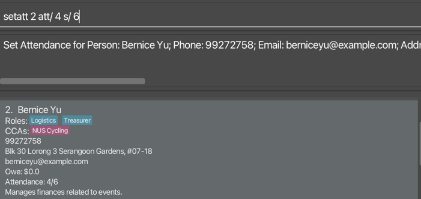
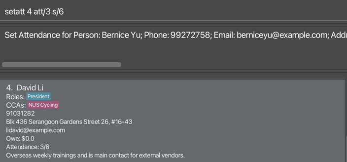

##### Possible Failures:

- session number less than attendance
- [_Index_](#Glossary) out of range
- Typed invalid number, number must be **non-negative**

Set attendance for each person

#### Delete a CCA: `cca_delete`
Delete a current existing CCA

##### Command Format:

$$
\large
\overbrace{\texttt{\colorbox{lightgrey}{cca\_delete}}}
    ^{\text{\colorbox{lightgrey}{Action}}}
\quad
\overbrace{\texttt{\colorbox{plum}{c/}\color{green}{NUS Cycling}}}
        ^{\text{\colorbox{plum}{CCA to delete}}}
$$

##### Examples:

```
cca_delete c/NUS Cycling 
```
```
cca_delete c/Jogging
```

##### Outcome:
###### Before delete
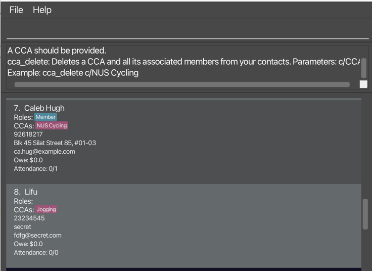

###### After delete
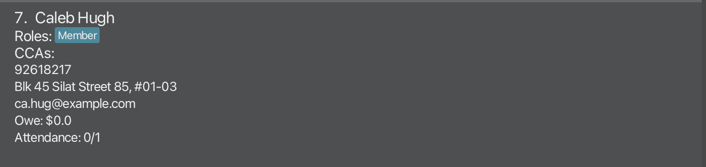
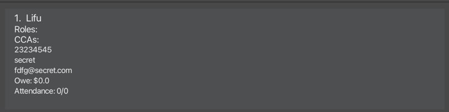
<box type="tip" seamless>

**Tip:**
*  After running this command, CCA Manager will only list contacts of the deleted CCA. Type the `list` command again to see all contacts.
   </box>

##### Possible Failures:

If you delete a non-existent CCA this command will fail.

### Deleting Contacts

#### Deleting a person: `delete`

Deletes the specified person from the CCA Manager.

##### Command Format:

$$
\large
\overbrace{\texttt{\colorbox{lightgrey}{delete}}}
    ^{\text{\colorbox{lightgrey}{Action}}}
\quad
\overbrace{\texttt{\fcolorbox{tomato}{transparent}{\color{green}{1}}}}
    ^{\substack{
        \text{\colorbox{gold}{Index of person}} \\
        \text{\colorbox{gold}{in \textbf{Result Box}}}
    }}
$$

##### Examples:

TODO

##### Outcome:

TODO

##### Possible Failures:

TODO

<!--
Format: `delete INDEX`

* Deletes the person at the specified `INDEX`.
* The index refers to the index number shown in the displayed person list.
* The index **must be a positive integer** 1, 2, 3, …​

Examples:
* `list` followed by `delete 2` deletes the 2nd person in the CCA Manager.
* `find Betsy` followed by `delete 1` deletes the 1st person in the results of the `find` command.
-->

#### Clearing all entries: `clear`

Clears all entries from the CCA Manager.

##### Command Format:

$$
\large
\overbrace{\texttt{\colorbox{lightgrey}{clear}}}
    ^{\text{\colorbox{lightgrey}{Action}}}
$$

##### Examples:

TODO

##### Outcome:

TODO

##### Possible Failures:

TODO

### Storage

#### Saving the data

CCA Manager data are saved in the hard disk automatically after any command that changes the data. There is no need to save manually.

#### Editing the data file

CCA Manager data are saved automatically as a [_JSON_](#Glossary) file `[JAR file location]/data/<TODO>.json`. Advanced users are welcome to update data directly by editing that data file.

<box type="warning" seamless>

**Caution:**
If your changes to the data file makes its format invalid, CCA Manager will discard all data and start with an empty data file at the next run.  Hence, it is recommended to take a backup of the file before editing it.<br>
Furthermore, certain edits can cause the CCA Manager to behave in unexpected ways (e.g., if a value entered is outside the acceptable range). Therefore, edit the data file only if you are confident that you can update it correctly.
</box>

#### Archiving data files `[coming in v2.0]`

_Details coming soon ..._

--------------------------------------------------------------------------------------------------------------------

## FAQ

**Q**: How do I transfer my data to another Computer?<br>
**A**: Install the app on the other computer and overwrite the empty data file it creates with the file that contains the data of your previous CCA Manager home folder.

**Q**: My administrative information is sensitive and should not be made public. Is it safe to use CCA Manager for my purposes? <br>
**A**: Yes. CCA Manager runs locally on your machine and does not connect to the internet nor does it have any functions to communicate outside of your computer. Your data will never leave your machine unless you want it to.

**Q**: Is there a cost associated with using CCA Manager? <br>
**A**: None! CCA Manager is free to use with no strings attached.

**Q**: What should I do if I encounter technical issues with CCA Manager? <br>
**A**: You can visit the [Common Issues](#common-issues) section if your problem is common. Otherwise, feel free to [open an issue](https://github.com/AY2324S2-CS2103T-W11-2/tp/issues). You would have to create a new [Github](https://github.com/) account to do so. This will allow us to maintain constant communication with you until the issue is addressed.

**Q**: How can I provide feedback or suggest improvements for CCA Manager? <br>
**A**: Feel free to [open an issue](https://github.com/AY2324S2-CS2103T-W11-2/tp/issues), your feedback is very valuable to us. You would have to create a new [Github](https://github.com/) account to do so. This will allow us to maintain constant communication with you until the issue is addressed.

## Common Issues

--------------------------------------------------------------------------------------------------------------------

## Known issues

1. **When using multiple screens**, if you move the application to a secondary screen, and later switch to using only the primary screen, the [_Graphic User Interface_](#Glossary) will open off-screen. The remedy is to delete the `preferences.json` file created by the application before running the application again.

--------------------------------------------------------------------------------------------------------------------

## Command summary

<box type="info" seamless>

**Notes about the command format:**<br>

<!-- TODO: Replace this to fit the actual documentation properly  -->
* Words in `UPPER_CASE` are the parameters to be supplied by the user.<br>
  e.g. in `add n/NAME`, `NAME` is a parameter that can be used as `add n/John Doe`.

* Items in square brackets are optional.<br>
  e.g `n/NAME [r/ROLE]` can be used as `n/John Doe r/friend` or as `n/John Doe`.

* Items with `…`​ after them can be used multiple times including zero times.<br>
  e.g. `[r/ROLE]…​` can be used as ` ` (i.e. 0 times), `r/friend`, `r/friend r/family` etc.

* Parameters can be in any order.<br>
  e.g. if the command specifies `n/NAME p/PHONE_NUMBER`, `p/PHONE_NUMBER n/NAME` is also acceptable.
* Extraneous parameters for commands that do not take in parameters (such as `help`, `list`, `exit` and `clear`) will be ignored.<br>
  e.g. if the command specifies `help 123`, it will be interpreted as `help`.

* If you are using a PDF version of this document, be careful when copying and pasting commands that span multiple lines as space characters surrounding line-breaks may be omitted when copied over to the application.

</box>

Action     | Format, Examples
-----------|---------------------------------------------------------------------------------------------------------------------------------------------------------------------
**Help**   | `help`
**Exit**   | `exit`
**List**   | `list`
**Find**   | `find KEYWORD [MORE_KEYWORDS]`<br> e.g., `find James Jake`
**Filter** | `filter [c/CCA]... [r/ROLE]...` <br> e.g. `filter c/ NUS Cycling` <br> e.g. `filter c/CCA Cycling r/colleagues`
**Add**    | `n/NAME p/PHONE e/EMAIL a/ADDRESS [r/ROLE]... [c/CCA]... [d/DESCRIPTION]` <br> e.g., `add n/James Ho p/22224444 e/jamesho@example.com a/123, Clementi Rd, 1234665 r/Treasurer r/Member c/CCA Cycling d/Manages money.`
**Edit**   | `edit INDEX [n/NAME] [p/PHONE] [e/EMAIL] [a/ADDRESS] [r/ROLE]... [c/CCA]... [d/DESCRIPTION]​`<br> e.g.,`edit 2 n/James Lee e/jameslee@example.com`
**Assign** | `assign INDEX [r/ROLE]...` <br> e.g. `assign 2 r/Member`
**Owe**    | `owe INDEX m/AMOUNT` <br> e.g. `owe 2 m/10.0`
**Charge** | `charge m/AMOUNT c/CCA r/ROLES` <br> e.g. `charge m/5.0 c/NUS Cycling r/member`
**Delete CCA** | `cca_delete c/CCA` e.g. `cca_delete c/NUS Cycling`
**Set Attendance** | `setatt INDEX att/NUMBER s/NUMBER` e.g. `setatt 2 att/6 s/7`
**Delete** | `delete INDEX`<br> e.g., `delete 3`
**Clear**  | `clear`


## Glossary

Term   | Explanation                                                                                                                                                                               
---------|-------------------------------------------------------------------------------------------------------------------------------------------------------------------------------------------
**Graphic User Interface** | What you see on your computer or phone screen when you're using programs or apps. It's the visual way you interact with your device.                                                      
**FAQ** | Frequently Asked Questions                                                                                                                                                                
**Project Repository** | A digital storage space or a virtual filing cabinet where all the files and documents related to a project are kept. It's usually hosted online using platforms like GitHub or Bitbucket. 
**Java** | A popular programming language that's used to build all sorts of software applications, from simple mobile apps to complex web servers. For more refer to: https://www.java.com/en           
**.jar file** | A package containing Java code, along with any other resources the program needs, such as images or configuration files. It stands for "Java ARchive."
**Linux** | Linux is an operating system, just like Windows or macOS, but it's built on a different foundation. For more refer to: https://www.linux.org
**macOS** | macOS is the operating system developed by Apple for their Macintosh computers. It's what makes everything run on your Mac, like opening apps, browsing the web, or organizing files. For more refer to: https://www.apple.com/macos/sonoma
**command terminal** | A text-based interface that allows you to interact with your computer using text commands instead of clicking on icons or buttons like you would in a graphical user interface (GUI). It's also known as a command line interface (CLI).
**Windows** |An operating system developed by Microsoft for personal computers. It's one of the most widely used operating systems in the world. For more refer to: https://www.microsoft.com/windows?r=1
**URL** | A web address that specifies the location of a resource on the internet. It's basically the address you type into your web browser to visit a specific webpage or access a file online.
**Index** | In this User Guide, it refers to the number that people appear in the list
**JSON** | It's a lightweight data-interchange format that is easy for humans to read and write and easy for machines to parse and generate. For more refer to: https://www.json.org
**Github** | A platform for hosting and sharing code repositories. It's like a social network for developers, where they can collaborate on projects, share code, and track changes to their code over time. For more refer to: https://github.com/
**Extraneous parameters** | In this User Guide, it refers to anything behind the command. e.g. cca_delete c/Jogging, c/Jogging is a parameter.

<script>
let woof = [...document.getElementById("content-wrapper").getElementsByTagName("a")].filter(a => a.href.includes("#")).filter(a => document.getElementById(a.href.split("#")[1]) === null).map(a => `  -- [${a.textContent}](${a.href.split("#")[1]})`).join("\n");
if (woof !== "") alert(`Broken links:\n${woof}`)
</script>
